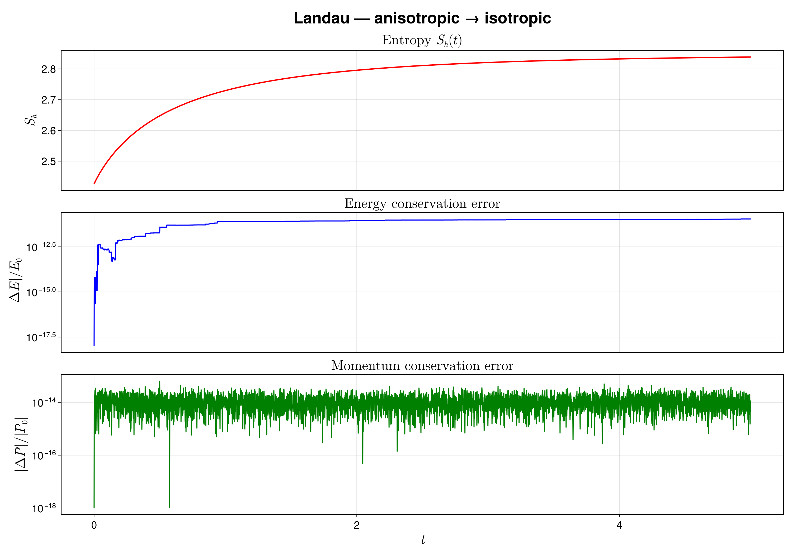
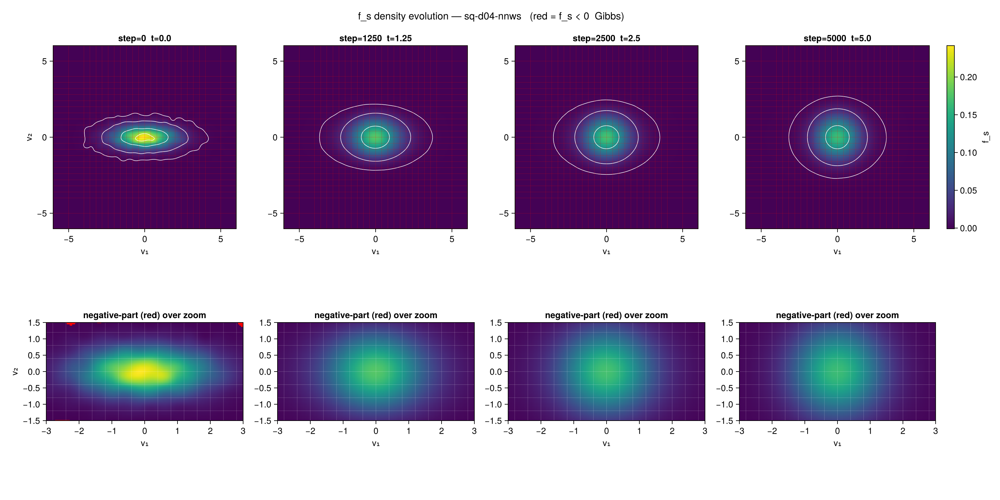
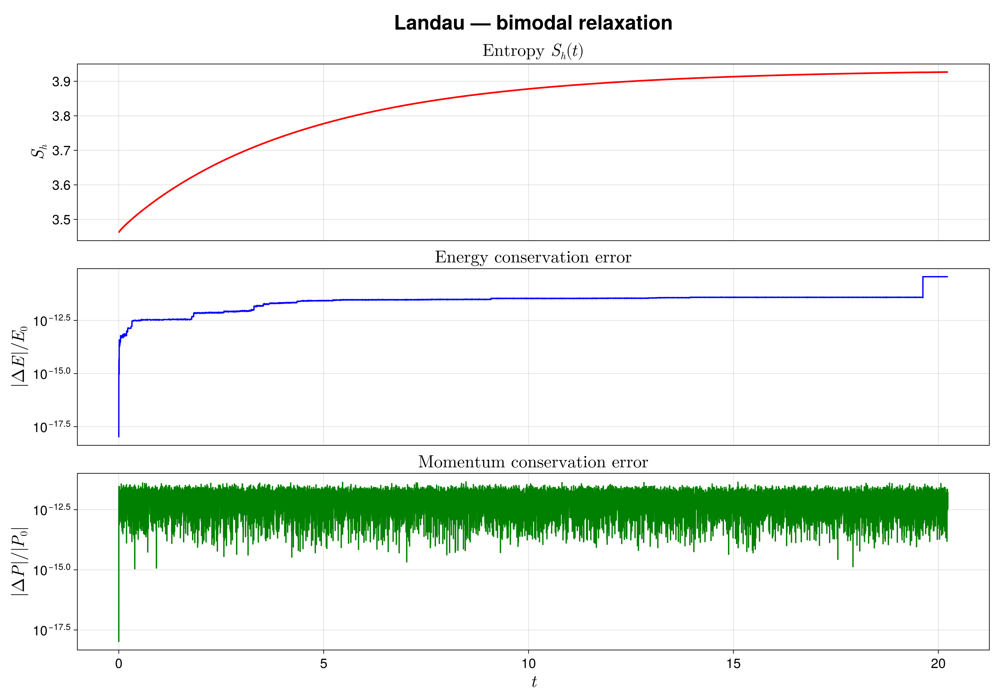
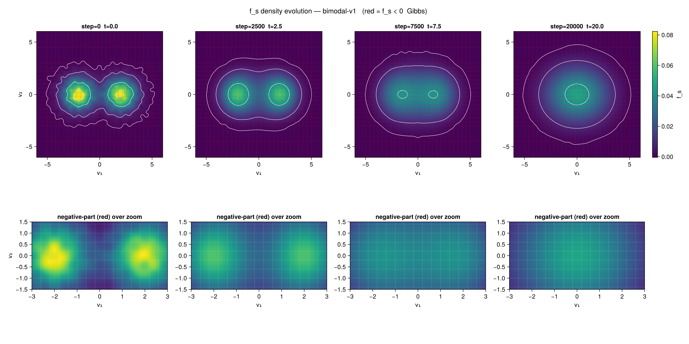

# CollisionOperators

[](https://JuliaPlasma.github.io/CollisionOperators.jl/stable/)
[](https://JuliaPlasma.github.io/CollisionOperators.jl/dev/)
[](https://github.com/JuliaPlasma/CollisionOperators.jl/actions/workflows/CI.yml?query=branch%3Amain)
[](https://codecov.io/gh/JuliaPlasma/CollisionOperators.jl)
[](https://JuliaCI.github.io/NanosoldierReports/pkgeval_badges/C/CollisionOperators.html)

Implementations of various collision operators such as Landau or Lenard–Bernstein.

## 2D Landau + Lenard–Bernstein (unified driver)

Structure-preserving particle discretisation of **both** the 2D Landau collision
operator and the conservative 2D Lenard–Bernstein operator behind a single
driver, `main.jl`. The density is reconstructed in a tensor-product B-spline
finite-element space (via [`Mantis`](https://github.com/JuliaPlasma/Mantis.jl));
markers are advanced by an implicit-midpoint solve (Picard / Anderson). The two
operators share the **identical** mesh, projection, and implicit-solver
scaffolding and differ *only* in the per-iteration right-hand side, so a run on
the same preset isolates operator-specific behaviour. Both conserve momentum and
energy and increase the discrete entropy exactly under the Gonzalez
discrete-gradient integrator. Follows Jeyakumar et al. (2024). See the
[documentation](https://JuliaPlasma.github.io/CollisionOperators.jl/dev/)
for the schemes, the discrete-gradient construction, and the LB conservation
algebra.

### Choosing the operator: `collision_model`

**Which operator runs is set by the `collision_model::Symbol` field of
`SimParameters`** — either in the preset file or as a CLI override. It takes one
of two values:

- **`collision_model = :landau`** — the Landau collision operator. Each marker's
  velocity update is the O(N²) perpendicular-projection sum over all other
  markers,

  ```
  v̇_α = Σ_γ w_γ · U(v_α − v_γ) · (∂S/∂v_α − ∂S/∂v_γ),   U(d) = (I − d̂ d̂ᵀ)/|d|
  ```

  i.e. a *velocity-dependent* collision frequency built from the FE entropy
  gradient. This is the GPU-accelerated path (`collision_gpu.jl`).

- **`collision_model = :lb`** — the conservative Lenard–Bernstein operator. The
  update is the O(N) drift

  ```
  v̇_α = −ν (∇f_s/f_s |_α + A + B v_α)
  ```

  with a *constant* collision frequency `ν` (the `nu` field) and multipliers
  `A ∈ ℝ²`, `B ∈ ℝ` obtained from a 3×3 linear system solved each iteration so
  that the discrete momentum `Σ w_α v̇_α` and energy `Σ w_α v_α·v̇_α` vanish
  exactly. The log-density gradient `∇f_s/f_s` is evaluated directly from the FE
  field.

Example — the *same* mesh/IC, one field flips the physics:

```julia
PARAMS = SimParameters(
    collision_model = :lb,   # ← :landau or :lb; default is :landau
    nu = 1.0,                # LB collision frequency (ignored when :landau)
    # … shared mesh / IC / solver knobs …
)
```

```sh
# or override on the command line without editing the preset:
julia --project=. main.jl parameters_sq_d04.jl --collision_model=lb --nu=1.0
```

### The other two axes

Alongside `collision_model`, two more `SimParameters` fields (preset or
`--key=value`) control the backend and the integrator:

| Parameter | Values | Meaning |
|-----------|--------|---------|
| `use_gpu` (+ `gpu_fp32`) | `false` / `true` | CUDA backend. For `:landau`, the O(N²) sum + projection run on device (`gpu_fp32=true` selects the FP32 kernel — a speed/conservation experiment). For `:lb`, the projection + log-gradient gather run on device while the O(N) drift stays on CPU. Requires `P_DEG == 2` for the projection kernels. |
| `use_gonzalez` | `true` / `false` | Gonzalez discrete-gradient integrator (entropy-exact) / plain implicit midpoint. Applies to both operators. |

### Source layout

| File | Role |
|------|------|
| `main.jl` | Unified driver: time loop, discrete-gradient / LB Picard map, implicit solve (Picard / Anderson), checkpoint/resume, CSV + PNG output; picks operator & backend from `SimParameters` |
| `functions.jl` | Both operators' physics: L² projection, entropy & entropy-gradient seed, particle log-gradient, Landau collision velocity, LB moments / drift multipliers / velocity update, diagnostics |
| `collision_gpu.jl` | CUDA O(N²) Landau kernels (Float64, plus a Float32 experiment) |
| `projection_gpu.jl` | CUDA `P_DEG=2` particle↔spline kernels shared by both operators: L² scatter, ∇L gather, log-gradient gather |
| `MantisWrappers.jl` | FEM scaffolding around `Mantis` (mesh, mass matrix, particle location/evaluation, `Workspace`) |
| `Parameters.jl` | `SimParameters` struct + CLI override parsing + (optionally bimodal) Gaussian IC sampling |
| `parameters_*.jl` / `parameters_LB_*.jl` | Landau / LB presets, each building a `PARAMS::SimParameters` |
| `plot_*.jl` | Post-processing plots of the CSV output (dashboards, fs-density, dS/dt operator comparison) |

### Run

```sh
# Landau (Gonzalez), CPU — the default operator:
julia --project=. main.jl parameters_sq_d04.jl
# Landau on GPU (Float64); add --gpu_fp32=true for the FP32 kernel:
julia --project=. main.jl parameters_sq_d04.jl --use_gpu=true
# Lenard–Bernstein, CPU:
julia --project=. main.jl parameters_LB_sq_d04.jl
# Lenard–Bernstein on GPU (projection + log-gradient on device):
julia --project=. main.jl parameters_LB_bimodal_v1.jl --use_gpu=true
# plain implicit midpoint instead of Gonzalez; scalar overrides:
julia --project=. main.jl parameters_sq_d04.jl --use_gonzalez=false --N_STEPS=200 --suffix=plainmid
# resume from last checkpoint:
julia --project=. main.jl parameters_sq_d04.jl --resume=auto
```

`ARGS[1]` is the preset file; `ARGS[2:]` are `--key=value` scalar overrides.
Vector fields (`bp1`, `bp2`) are not CLI-overridable — edit the preset.

### Examples — Landau operator

Two representative Landau runs (`collision_model=:landau`, Gonzalez integrator,
N = 40 000 markers, Δt = 0.001). Both conserve energy and momentum to the
solver floor and increase the discrete entropy monotonically.

**Anisotropic → isotropic.** A single anisotropic Gaussian (σ₁ = 4/3, σ₂ = 1/2)
relaxes to an isotropic Maxwellian. Entropy rises monotonically while energy is
conserved to `|ΔE|/E₀ ≲ 10⁻¹¹` and momentum to `≲ 10⁻¹⁴`:



The distribution becomes round by t ≈ 2.5 (the elongation along v₁ washes out):



**Bimodal relaxation.** A 50/50 mixture of `N(±2, 1)` in v₁ merges into a single
centred Maxwellian. Entropy is monotone all the way to t ≈ 20 with the same
machine-precision conservation:



The two peaks coalesce into one Gaussian:



### Output (per `suffix`)

- `conservation_history_<suffix>.csv` — one row per step:
  `step,time,entropy,energy,momentum_1,momentum_2,iter,residual,fp_minus_fs,neg_part,r0`
  (`r0` = initial pre-solve residual ‖r₀‖)
- `fs_snapshot_<suffix>_step#####.csv` — B-spline coefficients of `f_s`
  (mesh breakpoints in the header) every `snap_every` steps + final
- `dashboard_<suffix>.png` — per-run quick-look dashboard
- diagnostic PNG + particle dump + checkpoint at each snapshot step
