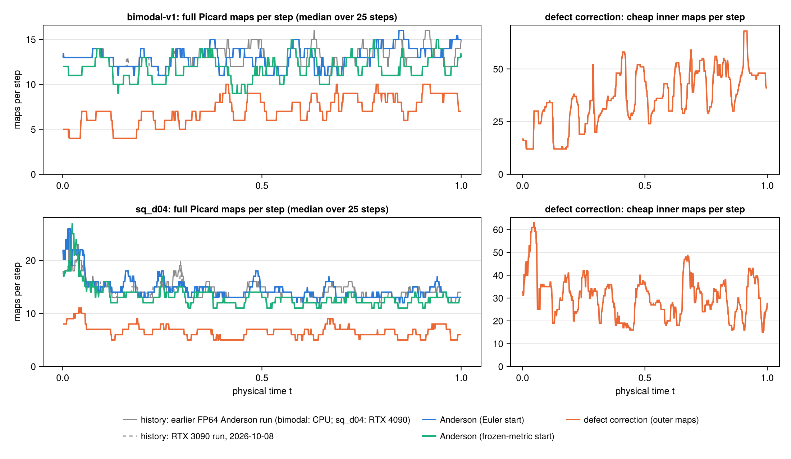
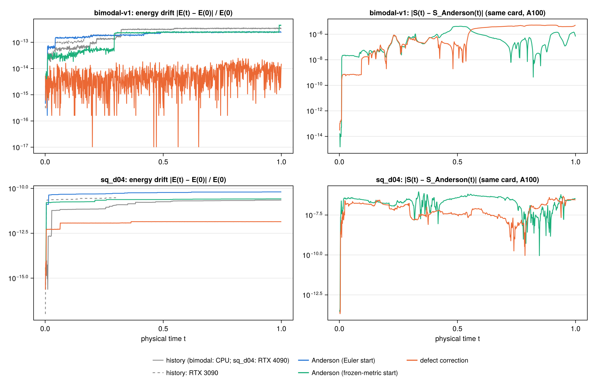
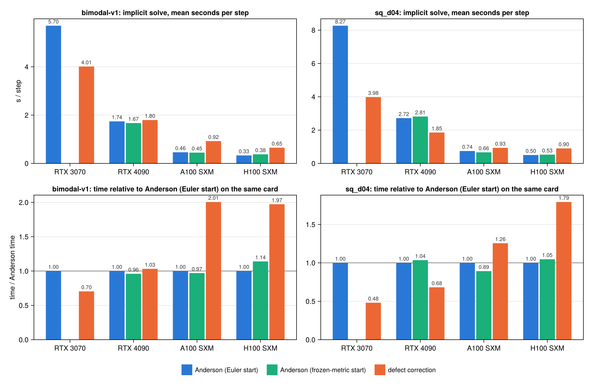

# Defect correction vs. Anderson

This page compares three ways of solving the implicit Landau step in FP64:

1. **Anderson** from the explicit Euler predictor: the production solver (`step_anderson!`).
2. **Anderson from a frozen-metric start** (`--warmstart=frozen`, only on the
   `feat/warmstart-nn` branch because it showed no reliable gain): a cheap
   approximation of one Picard step as the initial guess.
3. **Frozen-metric defect correction** (`--solver=defect`, `step_defect!`): a cheap
   inner model of the step, corrected by one full Picard map per outer iteration.

All three reach the same fixed point and return it through the same conservative
final Picard update. The comparison ran on four GPUs whose FP64 pair sum takes from
313 ms down to 5 ms: an RTX 3070, an RTX 4090, an A100 and an H100. The RTX 3070 ran
Anderson and defect correction only.

**Summary.**

- **Iterations.** Defect correction needs 2.2–3.5× fewer full maps per step (7.2–7.5
  against 16–26) and almost never stalls: 0–2 stalled steps in 1000, against 20–110 for
  Anderson.
- **Conservation.** Without stalls, its energy drift after 1000 steps is 10–550×
  smaller: $5\times10^{-15}$–$10^{-13}$ against $2\times10^{-13}$–$10^{-12}$ (bimodal), and
  $6\times10^{-14}$–$10^{-12}$ against $3$–$6\times10^{-11}$ (sq_d04). Momentum stays at
  roundoff ($\le 2\times10^{-14}$) for all three methods.
- **Wall time.** This depends on the card. On the RTX 3070 it is **1.42× faster than
  Anderson on bimodal and 2.08× faster on sq_d04**. On the RTX 4090 it is 1.47× faster on
  sq_d04 and ties on bimodal (1.03×). On the A100 and H100 it is 1.3–2.0× slower. Each
  cheap inner map still costs 9–18 ms of per-iteration overhead that does not depend on
  the card, and a step needs about 50 of them.
- **Frozen-metric start.** It saves 1–2 full maps per step, which is worth −11 % to +14 % in
  time depending on card and case. That is not a reliable gain.
- **When defect correction pays.** It pays when the FP64 pair sum $K$ is expensive
  compared with the per-iteration overhead $O$. The threshold falls the more Anderson
  stalls: $K/O \gtrsim 6$ on bimodal, $\gtrsim 2$ on sq_d04 (see
  [Cost model](#Cost-model)). Consumer cards with 1/64-rate FP64 meet it: the RTX 3070
  has $K/O \approx 9$ and wins on both cases, and the RTX 4090 has $K/O \approx 3$ and
  wins on sq_d04. The A100 and H100 have $K/O < 1$ and do not.

## Background: why not a better initial guess?

Anderson needs about 13–15 iterations per step in this setup. The original idea was to
halve this with a better initial guess from a per-particle neural network (on the
`feat/warmstart-nn` branch) on top of the
Euler predictor, leaving the solver untouched. Re-solving sampled steps from the
converged root plus a fraction $\varepsilon$ of the Euler error (an "oracle") gives
the best any predictor could do:

| mean iterations | $\varepsilon = 1$ (Euler) | 0.1 | 0.01 | 0.001 |
|:--|--:|--:|--:|--:|
| bimodal FP32 (`abs_floor = 1e-8`) | 13.3 | 8.4 | 6.4 | 4.8 |
| bimodal FP64 (`abs_floor = 1e-10`) | 13.2 | 10.8 | 9.0 | 6.9 |
| sq_d04 FP32 | 14.6 | 8.7 | 6.6 | 4.8 |
| sq_d04 FP64 | 13.7 | 11.7 | 9.7 | 7.8 |

Reaching about 7 iterations needs the Euler error 30× smaller in FP32, and about 1000×
smaller in FP64. The trained networks reduced it by 0.00 decades on held-out data.
Most of the error sits on particles in the velocity tails: the lowest-density 1 % of
particles carry 12–42 % of it. In the tails the projected $f_s$ is only a few particles
per cell, so the entropy gradient $G$ there is particle noise that changes every
step (step-to-step correlation 0.22–0.29). Neither per-particle features nor the
particles' history predict it. The same analysis pointed to the structure used below.

A probe on 60 sampled steps (RTX 3080, $N = 40\,000$, `scripts/predictor_probe.jl` on the
`feat/warmstart-nn` branch) then tested two cheaper uses of that structure:

- **Per-particle preconditioner.** Anderson on $v \mapsto v + P(\mathcal{G}(v) - v)$ with
  $P_\gamma = (I - J_{\gamma\gamma})^{-1}$, built from the 2×2 diagonal blocks of the Picard-map
  Jacobian. It did not reduce the iterations. The blocks are tiny, with median norm below
  0.002, so the slow convergence is collective rather than per particle.
- **Cheap start.** Moving only each particle's own $G$ under a frozen metric removed
  0.2–0.9 decades of the Euler error, but saved at most 1–2 iterations.

What did work was using the frozen metric for a whole inner solve, described next.

## The method

### The metric split

The Landau collision velocity of particle $\gamma$ is

```math
\dot v_\gamma = \sum_\alpha w_\alpha\, U(v_\gamma - v_\alpha)\,(G_\alpha - G_\gamma)
              = B_\gamma - A_\gamma G_\gamma ,
\qquad
A_\gamma = \sum_\alpha w_\alpha\, U(v_\gamma - v_\alpha) ,
\quad
B_\gamma = \sum_\alpha w_\alpha\, U(v_\gamma - v_\alpha)\, G_\alpha ,
```

with $U(z) = (I - \hat z \hat z^\top)/\lvert z\rvert$. The metric $A_\gamma$ and the sum
$B_\gamma$ change slowly with the particle positions and cost an $O(N^2)$ pair sum.
The entropy gradient $G = \nabla(M^{-1} r)$ changes fast but costs only an $O(N)$
projection.

### Defect correction

Write $\mathcal{G}$ for the Picard map of the step and $G_\text{eff}(u)$ for the
discrete gradient at the midpoint of $v^n$ and $u$, including the Gonzalez term
(`landau_geff!`). Outer iteration $k$:

1. Evaluate the full map $\mathcal{G}(v_k)$ and, in the same pair pass, $A_k$
   (`COLLMETRIC_FN`). If $\lVert \mathcal{G}(v_k) - v_k\rVert$ meets Anderson's stopping
   rule, return $\mathcal{G}(v_k)$.
2. Solve the cheap frozen-metric problem $u = \Phi_k(u)$ by Anderson, where

   ```math
   \Phi_k(u) = \mathcal{G}(v_k) - \Delta t\, A_k \bigl(G_\text{eff}(u) - G_\text{eff}(v_k)\bigr) ,
   ```

   to $\lVert \Phi_k(u) - u\rVert < \max(\eta\,\lVert \mathcal{G}(v_k) - v_k\rVert,\ \texttt{abs\_floor}/2)$,
   and set $v_{k+1} = u$.

$\Phi_k(v_k) = \mathcal{G}(v_k)$, so a fixed point of the outer iteration is a fixed
point of $\mathcal{G}$: the root is the same as Anderson's. Each $\Phi_k$ evaluation
costs a projection and the Gonzalez entropy, but no pair sum. The final update is a
true Picard step computed with the antisymmetric pair sum, so momentum and energy are
conserved as with Anderson. The outer loop is plain Richardson iteration. In the language of nonlinear
preconditioning, the inner solve is a physics-based nonlinear preconditioner.

### Frozen-metric start

*This variant is on the `feat/warmstart-nn` branch only.*

The frozen-metric start applies the same split once, as an initial guess. It moves each particle's own entropy
gradient to the Euler midpoint and keeps $A$ and the other particles' $G$ fixed:

```math
v^{(0)}_\gamma = v_{E,\gamma} - \Delta t\, A_\gamma \bigl(G_{\text{eff},\gamma}(v_E) - G^n_\gamma\bigr) ,
\qquad v_E = v^n + \Delta t\, \dot v^n .
```

It costs one $G_\text{eff}$ evaluation per step. The predictor's pair pass also returns
$A$, at the price shown below.

### Implementation

| option | meaning |
|:--|:--|
| `--solver=defect` | `step_defect!`; Landau only, FP64 pair kernel |
| `--dc_eta=0.05` | inner tolerance relative to the outer residual |
| `--dc_max_inner=60` | cap on inner maps per outer iteration |
| `--dc_stag_window=5` | outer iterations between stagnation checks |
| `--warmstart=frozen` | frozen-metric start for Anderson (`feat/warmstart-nn` only) |

The pair kernel `compute_collision_metric!` (CPU) and its GPU version return $F$ and $A$
in one pass. On the CPU, $F$ is bit-identical to `compute_collision!`. On the GPU it
agrees with the plain kernel to about one ulp (max $\lvert\Delta F\rvert$ of 2–4e-16),
because multiply-add fusion can differ. $A$ matches the CPU loop to 2e-14. Returning
$A$ costs 1.25–1.34× the plain kernel at $N = 40\,000$. Every run also writes
`solver_stats_<suffix>.csv` with the measured solve time per step.

## Setup

- **Cases.** bimodal-v1 (`parameters_bimodal_v1.jl`) and sq_d04 (`parameters_sq_d04.jl`),
  $N = 40\,000$, `DT = 0.001`, 1000 steps from $t = 0$, seed 42, FP64 pair kernel,
  `abs_floor = 1e-10`, `snap_every = 100`.
- **Cards.** RTX 4090 (Secure, EUR-IS-1), A100 SXM 80 GB (Secure, US-WA-1) and H100
  SXM (Secure, AP-IN-1) ran commits `f24b3ce` and `8e52179` on `feat/warmstart-nn`
  (comment-only difference). The RTX 3070 (Community) ran `main` at `d07857b`, with
  Anderson and defect correction only. The solver code is the same in all of them.
- **Runs.** `logs/run_methods.sh` in the Runpod workspace runs the kernel check and
  then the runs of one card, one after another. Data are under
  `mpcdf-s3:collision-operators/meth-*-2026-10-09`, and the figures come from
  `plot_solver_methods.jl` in the plotting repository.
- **History.** For comparison, earlier FP64 Anderson runs of the same setups: the original
  bimodal-v1 run (CPU) and `gzmid-gz64-dt1e3-4090-2026-10-08` (sq_d04, RTX 4090). Their
  mean iteration counts (15.8 and 25.4) match the new Anderson runs (16.0–17.2 and
  25.4–25.7).

## Results

### Iterations and conservation

The iteration counts agree across cards to within about one map per step, so the table shows the A100.

| case | method | full maps / step (mean, median) | inner maps / step | stalled steps | $\lvert E(1)-E(0)\rvert/E(0)$ |
|:--|:--|--:|--:|--:|--:|
| bimodal | Anderson | 16.0, 13 | — | 20 | $2.4\times10^{-13}$ |
| bimodal | frozen start | 15.5, 12 | — | 28 | $4.5\times10^{-13}$ |
| bimodal | defect | 7.5, 7 | 47.9 | 0 | $1.5\times10^{-14}$ |
| sq_d04 | Anderson | 25.4, 14 | — | 101 | $6.4\times10^{-11}$ |
| sq_d04 | frozen start | 24.2, 13 | — | 111 | $2.6\times10^{-11}$ |
| sq_d04 | defect | 7.2, 7 | 51.9 | 1 | $1.4\times10^{-12}$ |

A stalled step is one that leaves through the stagnation exit, so its iteration count is a multiple of 30. It
returns with a residual above the tolerance, and its energy error is first order in that
residual. The step-like rises in the energy drift of the Anderson runs are such steps.
All three methods agree in entropy to $10^{-7}$–$10^{-6}$, about the size of the
error those stalled steps leave.





### Wall time

Mean seconds per step of the implicit solve (`t_solve`), and the ratio to Anderson on the
same card:

| case | card | Anderson | frozen start | defect |
|:--|:--|--:|--:|--:|
| bimodal | RTX 3070 | 5.70 | — | **4.01 (0.70×)** |
| bimodal | RTX 4090 | 1.74 | 1.67 (0.96×) | 1.80 (1.03×) |
| bimodal | A100 | 0.46 | 0.45 (0.97×) | 0.92 (2.01×) |
| bimodal | H100 | 0.33 | 0.38 (1.14×) | 0.65 (1.97×) |
| sq_d04 | RTX 3070 | 8.27 | — | **3.98 (0.48×)** |
| sq_d04 | RTX 4090 | 2.72 | 2.81 (1.04×) | **1.85 (0.68×)** |
| sq_d04 | A100 | 0.74 | 0.66 (0.89×) | 0.93 (1.26×) |
| sq_d04 | H100 | 0.50 | 0.53 (1.05×) | 0.90 (1.79×) |



### Cost model

One full map costs the FP64 pair sum $K$ plus an overhead $O$ that does not depend on
the card's FP64 rate: the projections, the entropy quadrature and $r$ assembly, the
mass-matrix solve, host–device transfers and Anderson's least-squares update on 80 000
unknowns. The table gives $K$ from the kernel check, $O$ from the Anderson runs (median
time per map on steps that did not stall), and the cost $c$ of one inner map, fitted from
the defect runs:

| card | full map | $K$ | $O$ | $K/O$ | inner map $c$ |
|:--|--:|--:|--:|--:|--:|
| RTX 3070 | 347 ms | 313 ms | 34 ms | 9.2–9.3 | 9–14 ms |
| RTX 4090 | 106–107 ms | 79.9 ms | 26–28 ms | 2.9–3.1 | 17–18 ms |
| A100 | 27–29 ms | 12.8 ms | 14–17 ms | 0.8–0.9 | 13.4 ms |
| H100 | 18–19 ms | 5.0 ms | 13–14 ms | 0.4 | 11–13 ms |

An inner map costs about $O$ itself. Let a step take $n_A$ Anderson maps on average,
against about 7.5 outer maps $n_\text{out}$ and about 50 inner maps $n_\text{in}$ for
defect correction. Then defect correction is faster when

```math
n_A (K + O) > n_\text{out}(1.34 K + O) + n_\text{in}\, O ,
```

The threshold depends on how often Anderson stalls. On bimodal Anderson needs about 16 maps
per step, and defect correction pays from $K/O \approx 6$. On sq_d04 about 100 stalled steps of
60–120 maps each raise Anderson's mean to about 25, and the threshold drops to
$K/O \approx 2$. The RTX 4090, at $K/O \approx 3$, sits between the two, so the method ties
on bimodal and wins on sq_d04. The RTX 3070, at $K/O \approx 9$, is above both and wins on
both, by 1.42× and 2.08×.

The RTX 3080 probe that first suggested the method had $K \approx 220$ ms, and estimated
1.3–2.2× from map counts alone. The RTX 3070 runs, which include the Anderson overhead of
the inner iterations, land in the same range.

## Choosing a card

The cards differ in two ways that are easy to mix up:

- **Absolute speed.** The A100 and H100 run FP64 at full rate, so every method is fastest
  there. Even the best RTX 4090 result, 1.85 s per step on sq_d04 with defect correction, is
  slower than plain Anderson on the A100 (0.74 s) or the H100 (0.50 s).
- **Gain from defect correction.** This is the ratio to Anderson on the same card. It is
  largest on the cards with the weakest FP64, because the method trades pair sums for
  cheap inner maps, and the trade pays only when the pair sum is expensive.

Price changes the picture again. The table gives the faster of the two methods on `main`
(Anderson or defect correction) for each card. It shows the implicit-solve time for the
1000 steps (the sum of `t_solve`, without start-up, snapshots or plots) and its cost at the
Runpod list prices of 2026-10-09, in USD per hour: RTX 3070 0.13 (Community only), RTX 4090
0.34 / 0.89, A100 SXM 1.39 / 1.79 and H100 SXM 2.69 / 3.99 (Community / Secure).

| card | bimodal: method, time | cost, Community / Secure | sq_d04: method, time | cost, Community / Secure |
|:--|:--|--:|:--|--:|
| RTX 3070 | defect, 1.11 h | \$0.14 / — | defect, 1.11 h | \$0.14 / — |
| RTX 4090 | Anderson, 0.48 h | \$0.16 / \$0.43 | defect, 0.51 h | \$0.18 / \$0.46 |
| A100 | Anderson, 0.13 h | \$0.18 / \$0.23 | Anderson, 0.21 h | \$0.29 / \$0.37 |
| H100 | Anderson, 0.09 h | \$0.25 / \$0.37 | Anderson, 0.14 h | \$0.38 / \$0.56 |

The RTX 3070 with defect correction gives the cheapest result, but takes 8–12× longer
than the H100. The H100 gives the fastest result at about twice the cost. Without defect
correction the RTX 3070 would cost \$0.21 and \$0.30, so on that card the method halves the
cost of sq_d04. Community cards were often out of stock during these runs.

## Conclusions

- In FP64 on consumer GPUs, defect correction is the better solver: 1.42× (bimodal) and
  2.08× (sq_d04) faster on the RTX 3070, 1.47× faster on sq_d04 on the RTX 4090, with energy
  drift 45–550× smaller in those runs. On data-centre GPUs with full-rate FP64 (A100, H100),
  Anderson stays the fastest.
- Defect correction removes stalls and the energy drift they cause on every card. It
  needs 2.2–3.5× fewer full maps.
- The frozen-metric start does not give a reliable gain.
- Defect correction would become faster everywhere if the inner maps got cheaper or
  fewer. The options are:
  - **Fewer inner maps.** Use a looser inner tolerance (`dc_eta`), or an accelerated outer
    loop instead of plain Richardson iteration. A nonlinear-preconditioning framework would
    provide one, with the frozen-metric solve as the preconditioner of an outer
    Anderson/NGMRES or Newton–Krylov.
  - **Smaller $O$.** Move Anderson's least-squares update and the entropy quadrature to
    the GPU. A smaller $O$ speeds up Anderson too.
